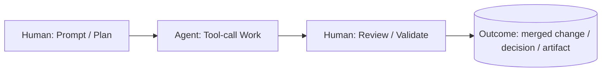
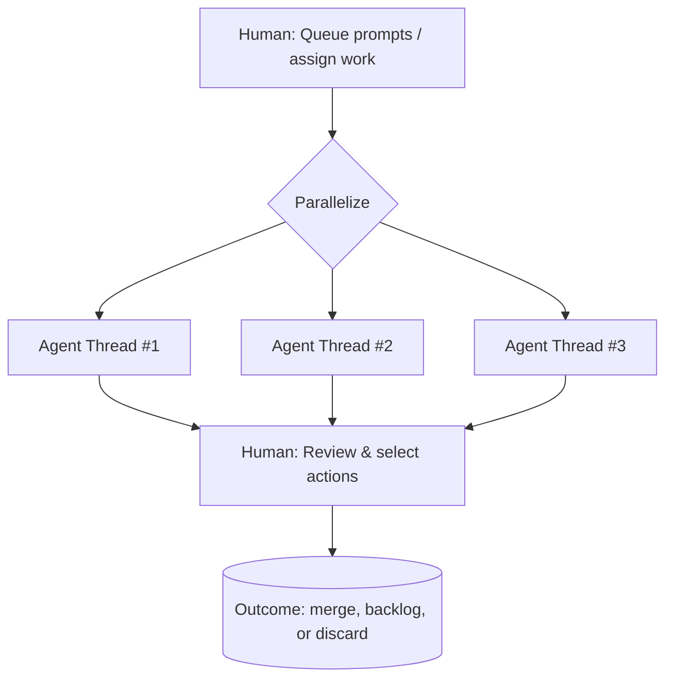
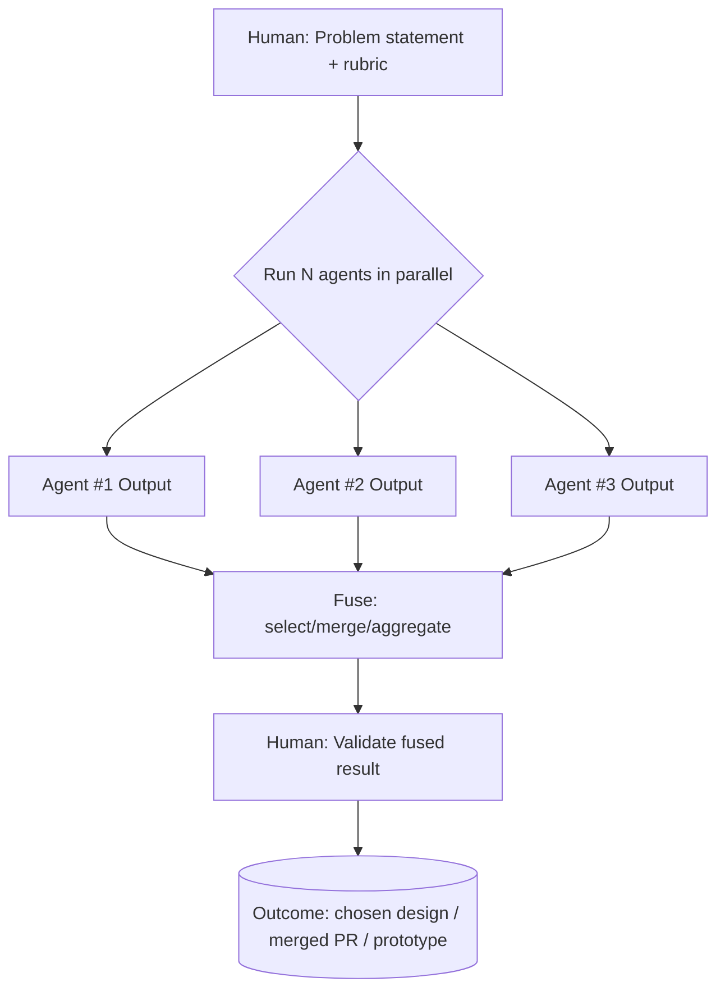
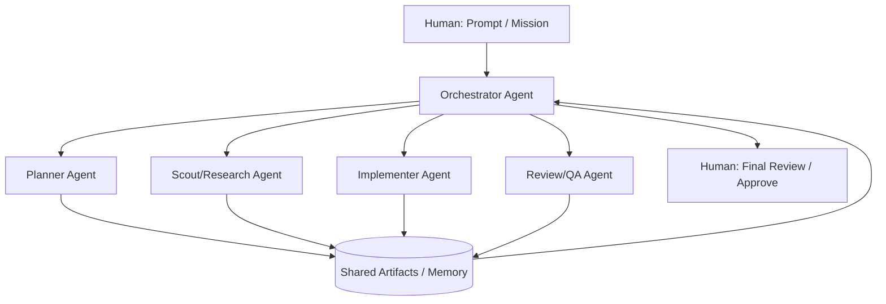
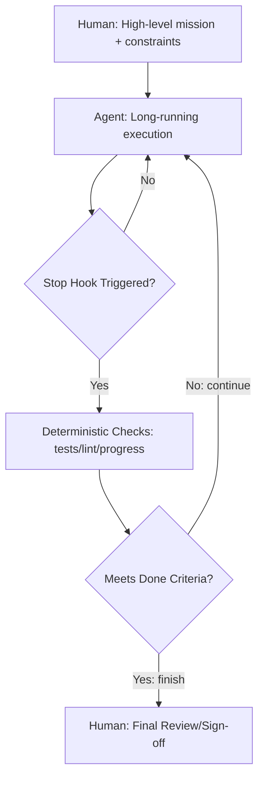
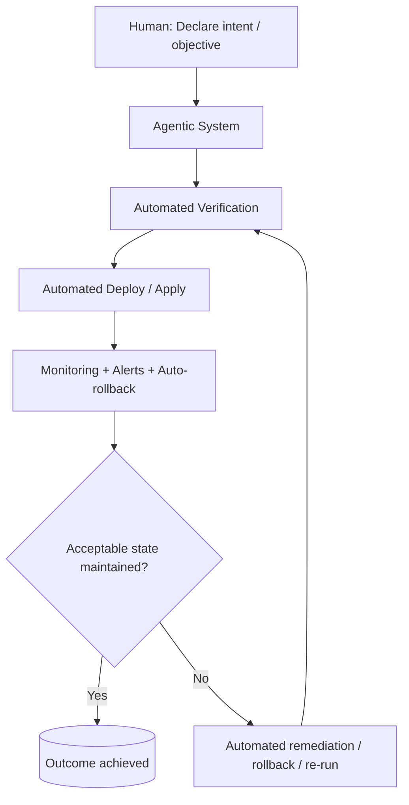
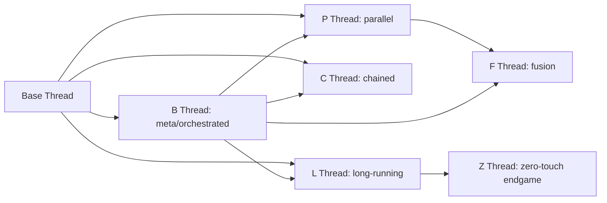

```mermaid
flowchart LR
  H1[Human: Phase 1 Prompt] --> A1[Agent: Execute Phase 1]
  A1 --> V1[Human: Review Phase 1]
  V1 --> H2[Human: Phase 2 Prompt]
  H2 --> A2[Agent: Execute Phase 2]
  A2 --> V2[Human: Review Phase 2]
  V2 --> H3[Human: Phase 3 Prompt]
  H3 --> A3[Agent: Execute Phase 3]
  A3 --> V3[Human: Final Review]
```

# AI Agent Thread Patterns — Strategic Workflows

**Thread-based engineering framework** for defining, visualizing, and cataloging AI agent workflow patterns into strategic mental models.

<aside>
🎯

**Primary Source**

Thread-Based Engineering methodology from [Thread Based Engineering[1]](https://www.youtube.com/watch?v=-WBHNFAB0OE)

**Core insight:** A thread is a unit of engineering work over time where humans show up at start (prompt/plan) and end (review/validation), while agents execute the middle work via tool calls.

</aside>

### Progress Tracker

- [x]  Identify all thread types (explicit + implied)
- [x]  Extract definitions + operational implications
- [x]  Create pattern library for engineering docs
- [x]  Produce Mermaid diagrams per pattern
- [x]  Self-critique and revision

---

## Shared Vocabulary

### What a "Thread" Is

**Thread:** Unit of engineering work over time where:

- **You** show up at start (prompt/plan) and end (review/validation)
- **Agents** execute middle work via tool calls[[1]](https://www.youtube.com/watch?v=-WBHNFAB0OE)

### Mandatory Nodes

- **Prompt/Plan node** — human initiates intent
- **Review/Validate node** — human validates outcome

Even as autonomy increases, framework tracks how these nodes shrink, move, or disappear (Z-thread).[[1]](https://www.youtube.com/watch?v=-WBHNFAB0OE)

### Tool Calls ≈ Impact

**Tool calls** serve as measurable proxy for output/impact (assuming useful prompts). Requires instrumentation: logs, counts, costs, pass/fail metrics.[[1]](https://www.youtube.com/watch?v=-WBHNFAB0OE)

---

## Thread Patterns

### 1) Base Thread (T0) — The Atomic Unit

**What it is**

Simplest thread shape:

- Human prompts/plans
- Agent executes tool call chain
- Human reviews/validates

Foundational unit everything else scales from.[[1]](https://www.youtube.com/watch?v=-WBHNFAB0OE)

**When to use**

- Single well-scoped task fitting one context window
- Clarity prioritized over throughput
- Calibrating trust in repo/system

**Best practices**

- Define success criteria in prompt (tests, build passing, lint clean)
- Capture artifacts (diff, logs, test output) as thread deliverable
- Store thread record: prompt, tool-call trace, outputs, review decision

**Failure modes**

- "Vibe output" — no objective verification
- Heavy review step from unconstrained prompts

**Diagram**

---

### 2) P Thread — Parallel Threads

**What it is**

Multiple Base Threads running concurrently (multiple terminals, tabs, worktrees, sandboxes). Boris Cherny runs 5 Claude Code sessions in terminal + 5-10 in web UI.[[1]](https://www.youtube.com/watch?v=-WBHNFAB0OE)

**Two P-thread modes**

**A) Partitioned parallelism** (different tasks)

- Each thread tackles different subproblem (docs, tests, refactor, feature)
- Output: set of deliverables to review

**B) Redundant parallelism** (same prompt, multiple runs)

- Same task sent to multiple agents
- Purpose: **confidence** via convergence or diversity[[1]](https://www.youtube.com/watch?v=-WBHNFAB0OE)

**When to use**

- Multiple independent tasks
- Faster iteration via more compute
- Multi-review / multi-opinion checking

**Operational requirements**

- **Task isolation** — separate worktrees/branches to avoid collisions
- **Naming/Indexing** — stable IDs (T1, T2, T3) for tracking thread states
- **Result normalization** — enforce thread output schema (summary, diff, commands, risks)

**Failure modes**

- Human review bottleneck (too many parallel outputs)
- Context fragmentation without dashboard/log

**Diagram**

---

### 3) C Thread — Chained Threads

**What it is**

Breaks large objective into **phases** with **intentional checkpoints** where human re-enters to review before continuing. Not "agent failure" — deliberate chunking for context or production risk.[[1]](https://www.youtube.com/watch?v=-WBHNFAB0OE)

**Primary use cases**

1. Work doesn't fit single context window
2. High-pressure production work requiring per-step correctness[[1]](https://www.youtube.com/watch?v=-WBHNFAB0OE)

**Critical implications**

Each phase produces **verifiable artifact:**

- "Migration plan approved"
- "PR created"
- "Tests green"
- "Staging verified"

**Phase contract:** phase N output becomes phase N+1 input

**Stop mechanism:** agent knows how to pause and signal completion[[1]](https://www.youtube.com/watch?v=-WBHNFAB0OE)

**Failure modes**

- Too many phases → excessive human overhead
- Poor phase boundaries → repeated work or unclear state

**Diagram**

---

### 4) F Thread — Fusion Thread

**What it is**

Starts like P-thread (multiple parallel runs), then **fuses** results:

- Choose best ("best-of-N")
- Cherry-pick and merge into superior result

Called "fusion chain" in transcript, strongly tied to rapid prototyping.[[1]](https://www.youtube.com/watch?v=-WBHNFAB0OE)

**Why it works**

Probabilistic reliability hack:

- More attempts → higher chance at least one correct
- Agent agreement → higher confidence
- Agent diversity → richer solution space

**Variants**

**A) Best-of-N**

Pick strongest single output by rubric (tests, simplicity, safety, cost)

**B) Ensemble merge**

Combine best elements from 2–N outputs into integrated plan/patch

**C) Debate + adjudication**

One agent critiques another, judge agent reconciles[[1]](https://www.youtube.com/watch?v=-WBHNFAB0OE)

**Failure modes**

- "Merge hell" — outputs incompatible due to unshared constraints
- Human becomes fusion engine without aggregator agent

**Diagram**

---

### 5) B Thread — Big Thread / Meta-Thread

**What it is**

**Meta structure** where initial prompt triggers agent system that triggers **sub-agents**, workflows, or teams ("agents prompting agents"). "Thicker threads" where more happens inside one time unit.[[1]](https://www.youtube.com/watch?v=-WBHNFAB0OE)

**Key property**

From human perspective:

- Show up at **start** and **end**
- Inside becomes **black box** (by design) if engineered correctly[[1]](https://www.youtube.com/watch?v=-WBHNFAB0OE)

**Typical internal compositions**

- **Plan agent → Build agent**
- **Scout agent → Implement agent → Review agent(s)**
- **Orchestrator agent** spawning and coordinating specialists[[1]](https://www.youtube.com/watch?v=-WBHNFAB0OE)

**Non-negotiable requirements**

- **Orchestration policy** — who spawns whom, max depth, budgets
- **Shared memory / artifact bus** — where outputs go for downstream consumption
- **"Definition of done" contract** enforced by orchestrator (tests, lint, validations)

**Ralph Wiggum connection**

B-thread embodies **"agents + code outperforms agents alone"** principle. Ralph Wiggum as loop/workflow pattern.[[1]](https://www.youtube.com/watch?v=-WBHNFAB0OE)

**Diagram**

---

### 6) L Thread — Long-Duration Thread

**What it is**

"Extended autonomy" base shape:

- Same structure as Base Thread
- **Much longer**, many more tool calls, runs for hours

"High autonomy end-to-end long duration work."[[1]](https://www.youtube.com/watch?v=-WBHNFAB0OE)

**What makes it different**

**Self-verification:**

- Agent validates own work (tests, commands, checkers)
- Hardened permissions, guardrails, progress signaling[[1]](https://www.youtube.com/watch?v=-WBHNFAB0OE)

**Stop Hook / Validation Loop**

Agent stop hook workflow:

1. Agent attempts to stop
2. Stop hook runs deterministic checks (progress file, validation command)
3. Decision: continue looping or finish

"Code + agents" bridge.[[1]](https://www.youtube.com/watch?v=-WBHNFAB0OE)

**Best practices**

- **Autonomy budget** — max tool calls, max cost, max runtime
- **Progress heartbeat** — periodic summaries and current objective state
- **Auto-recovery** — retry policies, safe rollback, idempotent actions

**Diagram**

---

### 7) Z Thread — Zero-Touch Thread

**What it is**

"Hidden seventh thread": **maximum trust**, "zero touch", critically: **no review node** (or review becomes unnecessary).[[1]](https://www.youtube.com/watch?v=-WBHNFAB0OE)

**What's implied**

Z-thread ≠ "no one checks anything"

Verification **delegated** to:

- Deterministic checks (CI, tests)
- Formal policies (permissions, guardrails)
- Multiple agent review layers (internal)
- Staging/prod canaries/observability

**Review replaced by system trust infrastructure.**

**Preconditions (readiness checklist)**

- Strong CI, reproducible environments, stable tests
- Safe deploy pipeline, rollback
- Agent actions bounded, auditable, policy-checked
- Monitoring detects failure and triggers remediation
- "Definition of done" is machine-checkable

**Diagram**

---

## Summary Table

| Thread | Core purpose | Human touchpoints | Primary scaling dimension | Key risk |
| --- | --- | --- | --- | --- |
| **Base** | Single unit of work | Start + end | None | Weak verification burdens review |
| **P** | Throughput / confidence | Start + multi-review | More threads | Human becomes bottleneck |
| **C** | Risk & context management | Many checkpoints | Phased correctness | Too many phases = overhead |
| **F** | Quality via consolidation | Start + fusion review | More attempts + merge | Incompatible outputs |
| **B** | Thicker work via orchestration | Start + end | Nested subthreads | Hidden complexity without observability |
| **L** | Long autonomy | Start + end (few) | Duration + tool calls | Runaway cost / drift |
| **Z** | Zero-touch outcomes | Start only (goal) | Trust infrastructure | Catastrophic silent failure if controls weak |

---

## Four Improvement Axes

Framework's explicit "how do you know you're improving" metrics:[[1]](https://www.youtube.com/watch?v=-WBHNFAB0OE)

1. Run **more** threads
2. Run **longer** threads
3. Run **thicker** threads (nested agents / meta-threads)
4. Run **fewer** human-in-the-loop checkpoints

Map to internal maturity model and SLOs (time-to-merge, failure rate, cost per feature).[[1]](https://www.youtube.com/watch?v=-WBHNFAB0OE)

---

## Thread Evolution Map

---

## Thread Laboratory — Experimentation Workspaces

Each thread pattern has dedicated workspace for deep experimentation, workflow testing, and implementation refinement.

[Base Thread Lab — T0](Base%20Thread%20Lab%20%E2%80%94%20T0%20da5a8fce50664dec81493eadbf5a82f3.md)

[P Thread Lab — Parallel Execution](P%20Thread%20Lab%20%E2%80%94%20Parallel%20Execution%20fde9f627d7464fa4978205686b295e43.md)

[C Thread Lab — Chained Checkpoints](C%20Thread%20Lab%20%E2%80%94%20Chained%20Checkpoints%20e8ee18936ae947fba6282179090a905e.md)

[L Thread Lab — Long-Running Autonomy](L%20Thread%20Lab%20%E2%80%94%20Long-Running%20Autonomy%206f62574e5d3947678dcea60451b0325a.md)

[Z Thread Lab — Zero-Touch Endgame](Z%20Thread%20Lab%20%E2%80%94%20Zero-Touch%20Endgame%20096fd79cecce483c9574839608937f40.md)

[Thread Consultant — Selection Framework](Thread%20Consultant%20%E2%80%94%20Selection%20Framework%20b6adda268a35408e888efc800d01b7e1.md)

[F Thread Lab — Fusion Patterns](F%20Thread%20Lab%20%E2%80%94%20Fusion%20Patterns%205350f095a6714d2ebbad7f7ed10eff4a.md)

[Constraint Agents](Constraint%20Agents%2019cc487604f48098917cc440fa383cee.md)

[B Thread Lab — Meta Orchestration](B%20Thread%20Lab%20%E2%80%94%20Meta%20Orchestration%20ab4145e4d17d4d19ade9791b805ad968.md)