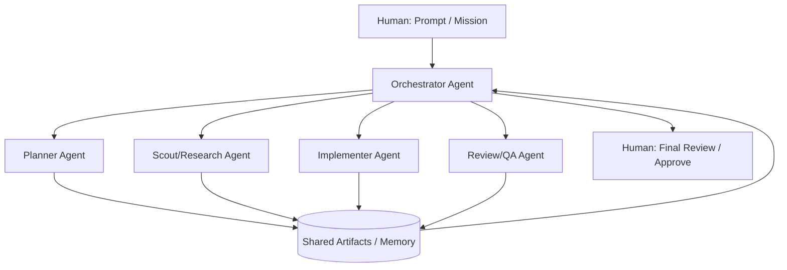

# B Thread Lab — Meta Orchestration

# B Thread — Big Thread / Meta-Thread

**Agents prompting agents:** Meta structure where initial prompt triggers sub-agents, workflows, teams

"Thicker threads" — more happens inside one time unit.[[1]](https://www.youtube.com/watch?v=-WBHNFAB0OE)

---

## Pattern Definition

### Structure



### Key Property

From human perspective:

- Show up at **start** and **end**
- Inside becomes **black box** (by design)[[1]](https://www.youtube.com/watch?v=-WBHNFAB0OE)

**You engineered it right, so it just works**

---

## Internal Compositions

### Pattern 1: Plan → Build

```
Orchestrator
  ↓
Planner Agent: Create detailed spec
  ↓
Builder Agent: Implement from spec
  ↓
Orchestrator: Return to human
```

### Pattern 2: Scout → Implement → Review

```
Orchestrator
  ↓
Scout Agent: Research approaches
  ↓
Implement Agent: Build solution
  ↓
Review Agent(s): Validate quality
  ↓
Orchestrator: Return to human
```

### Pattern 3: Full Team

```
Orchestrator
  ├─ Plan agent
  ├─ Scout agent
  ├─ Implement agent
  ├─ Test agent
  ├─ Review agent #1
  ├─ Review agent #2
  └─ Pre-deploy staging agent
```

---

## Non-Negotiable Requirements

### 1. Orchestration Policy

**Must define:**

- Who spawns whom
- Max nesting depth
- Budget limits (cost, time, tokens)
- Failure handling
- When to escalate to human

### 2. Shared Memory / Artifact Bus

**Central store where:**

- Sub-agents write outputs
- Downstream agents read inputs
- Orchestrator tracks progress
- Human can inspect state

**Implementation options:**

- File system (simple)
- Database (structured)
- Message queue (streaming)
- Graph database (relationships)

### 3. Definition of Done Contract

**Orchestrator enforces:**

- Tests passing
- Lint rules satisfied
- Documentation complete
- Validations passed

**Agent cannot signal "done" until contract met**

---

## Ralph Wiggum Connection

### "Agents + Code Outperforms Agents Alone"[[1]](https://www.youtube.com/watch?v=-WBHNFAB0OE)

**Ralph Wiggum:** Loop/workflow pattern combining deterministic code with agents

**In B Thread context:**

Orchestrator uses deterministic code to:

- Route between agents
- Validate outputs
- Enforce contracts
- Manage state

While agents provide:

- Creative problem solving
- Code generation
- Complex reasoning

**Result:** Reliable meta-structure around unreliable components

### ADW (AI Developer Workflows)

**Pattern that preceded Ralph Wiggum naming:**

Code + Agents working together in workflow

B Thread is ADW at scale

---

## Sub-Agent Patterns

### Claude Code Sub-Agents

**Simplest B Thread:**

Primary agent spawns sub-agents for specific work

```
Prompt primary agent:
"Use sub-agents to:
 1. Research best approach
 2. Implement solution
 3. Write tests"
```

Primary agent orchestrates, sub-agents execute

### Orchestrator Agent Pattern

**Next level up:**

Dedicated orchestrator doesn't do work, only coordinates

**Orchestrator responsibilities:**

- CRUD operations on agents
- Route work to specialists
- Monitor progress
- Handle failures
- Report to human

---

## Observability Requirements

**Without observability, B Thread = hidden complexity**

### Must instrument:

✅ **Agent spawning** — Who created whom, when

✅ **Communication** — Messages between agents

✅ **Progress** — What's complete, what's pending

✅ **Artifacts** — What each agent produced

✅ **Costs** — Tokens, time, money per agent

✅ **Failures** — What failed, why, how handled

### Dashboard should show:

- Real-time agent tree (who's running)
- Artifact flow (data dependencies)
- Cost burn rate
- Progress toward done contract

---

## Experimentation Workspace

### Current Experiments

- **Experiment 1: Simple sub-agent workflow**

- **Experiment 2: Orchestrator with specialized agents**

- **Experiment 3: Nested B Threads (B inside B)**

---

## Implementation Notes

### Your Orchestration Stack

**Primary tool:**

**Artifact bus:**

**Observability:**

### Prompt Templates

**Sub-agent template (Claude Code):**

```
Use sub-agents to accomplish [mission]

Sub-agent 1: [specific role and task]
Sub-agent 2: [specific role and task]
Sub-agent 3: [specific role and task]

You orchestrate, they execute.
Report aggregated results.
```

**Orchestrator template:**

```
You are orchestrator agent.

Mission: [high-level goal]

Available specialist agents:
- planner: Creates detailed specs
- researcher: Finds information
- builder: Implements solutions
- tester: Writes and runs tests
- reviewer: Validates quality

Your job:
1. Break mission into phases
2. Assign each phase to appropriate specialist
3. Coordinate handoffs between specialists
4. Validate Definition of Done before finishing

Do NOT do the work yourself. Route to specialists.
```

---

## Success Metrics

### KPIs to Track

| Metric | Target | Current |
| --- | --- | --- |
| Sub-agents per B-thread | 3-7 | — |
| Human review time | < 10 min | — |
| Success rate (first try) | > 70% | — |
| Cost per B-thread | < $10 | — |
| Black box reliability | Subjective | — |

### Scaling Signals

✅ Comfortable delegating to agent teams

✅ Can predict B Thread outcomes

✅ Rarely need to intervene mid-execution

✅ Observability makes debugging fast

✅ Ready to nest B Threads (B inside B)

---

## Next Evolution

B Thread mastery enables:

→ **Nested B Threads** — Orchestrator spawns orchestrators

→ **Specialized agent libraries** — Pre-built agent teams

→ **Agent CRUD systems** — Programmatic agent management

→ **Z Thread foundation** — Zero-touch through reliable orchestration