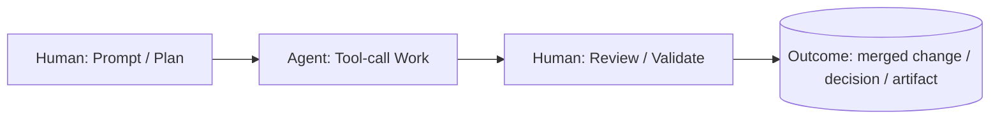

# Base Thread Lab — T0

# Base Thread (T0) — The Atomic Unit

**Simplest thread shape:** Human prompts → Agent executes → Human reviews

Foundational unit everything else scales from.[[1]](https://www.youtube.com/watch?v=-WBHNFAB0OE)

---

## Pattern Definition

### Structure



### Core Components

**Prompt/Plan node**

- Human initiates intent
- Define success criteria upfront
- Constrain outputs for fast review

**Agent execution**

- Chain of tool calls
- Measurable proxy for impact
- Instrumented: logs, counts, costs, pass/fail

**Review/Validate node**

- Human validates outcome
- Should be fast if prompt well-defined
- Capture decision in thread record

---

## When to Use

✅ Single well-scoped task fitting one context window

✅ Clarity prioritized over throughput

✅ Calibrating trust in repo/system

✅ Learning agent capabilities in new domain

---

## Best Practices

### Define Success Criteria

**In prompt, specify:**

- Tests that must pass
- Build status requirements
- Lint/format rules
- Acceptance checks

**Result:** Review step becomes verification, not detective work

### Capture Artifacts

**Thread deliverable includes:**

- Code diff
- Command logs
- Test output
- Error traces (if any)

### Thread Record

Store for analysis:

- Original prompt
- Tool-call trace
- Agent outputs
- Review decision
- Time/cost metrics

---

## Failure Modes

### "Vibe Output"

**Problem:** Agent finishes but no objective verification exists

**Fix:** Add deterministic checks to prompt (tests, build, lint)

### Heavy Review Burden

**Problem:** Review step takes longer than expected

**Root cause:** Prompt didn't constrain outputs

**Fix:** More specific success criteria upfront

---

## Experimentation Workspace

### Current Experiments

- **Experiment 1:**

- **Experiment 2:**

- **Experiment 3:**

---

## Implementation Notes

### Your Stack Integration

**Primary tool:**

**Context management:**

**Verification approach:**

### Prompt Templates

**Template 1: Feature implementation**

```
Implement [feature] with these requirements:
- Tests: [specific test cases]
- Constraints: [technical constraints]
- Success: [definition of done]

Deliverable: Working code + passing tests + summary
```

**Template 2: Bug fix**

```
Fix [issue] in [file/module]:
- Current behavior: [description]
- Expected behavior: [description]
- Validation: [how to verify fix]

Deliverable: Minimal diff + test proving fix
```

**Template 3: Code review**

```
Review [file/PR]:
- Check: [specific concerns]
- Standards: [coding standards to verify]
- Output: Structured feedback with line references
```

---

## Success Metrics

### KPIs to Track

| Metric | Target | Current |
| --- | --- | --- |
| Time to completion | < 5 min | — |
| Tool calls per thread | 10-30 | — |
| Review time | < 2 min | — |
| Success rate (first try) | > 80% | — |
| Cost per thread | < $0.50 | — |

### Improvement Signals

✅ Review time decreasing (better prompts)

✅ Fewer revision cycles (clearer constraints)

✅ Can predict thread duration (calibrated trust)

---

## Next Evolution

Base Thread mastery enables:

→ **P Thread** — Run multiple Base Threads in parallel

→ **L Thread** — Extend Base Thread duration and autonomy

→ **C Thread** — Chain Base Threads with checkpoints