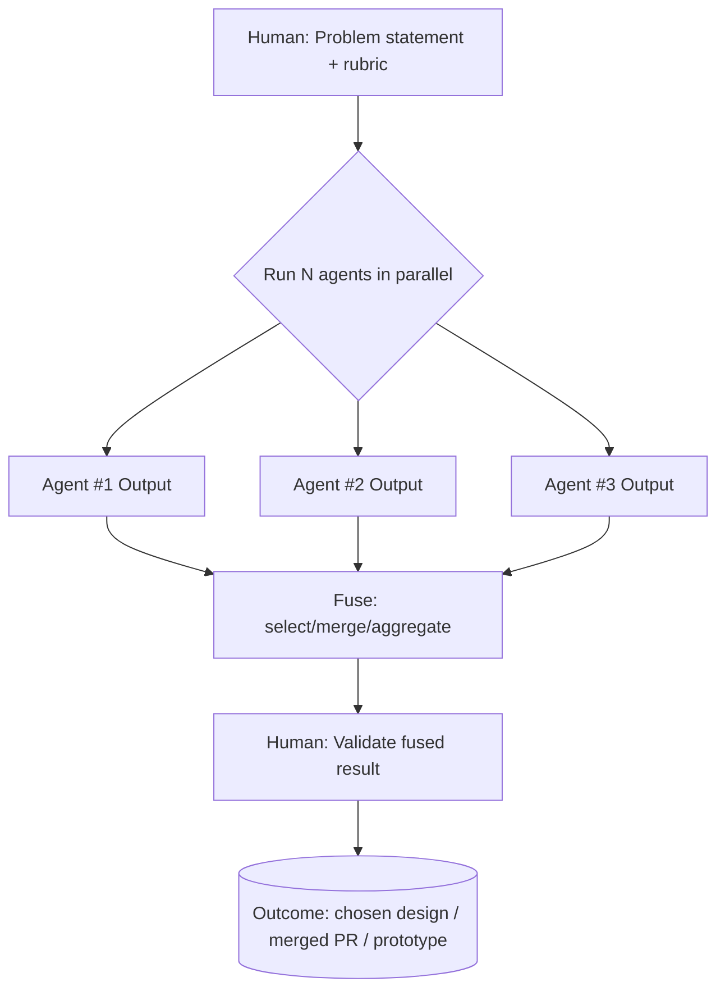

# F Thread Lab — Fusion Patterns

# F Thread — Fusion Thread

**Best-of-N / Merge-of-N:** Parallel runs fused into superior result

"Fusion chain" for rapid prototyping and confidence.[[1]](https://www.youtube.com/watch?v=-WBHNFAB0OE)

---

## Pattern Definition

### Structure



### Why It Works

**Probabilistic reliability hack:**

✅ More attempts → higher chance at least one correct

✅ Agent agreement → higher confidence

✅ Agent diversity → richer solution space

---

## Three Fusion Variants

### Variant A: Best-of-N

**Process:**

1. Run N agents in parallel (same prompt)
2. Evaluate each by rubric
3. Select single strongest output

**Rubric examples:**

- Tests passing
- Code simplicity
- Security/safety
- Performance/cost
- Alignment to requirements

**When to use:** Clear success criteria, binary decision

### Variant B: Ensemble Merge

**Process:**

1. Run N agents in parallel
2. Identify best elements from each
3. Combine into integrated solution

**Merge strategies:**

- Cherry-pick best ideas
- Combine complementary approaches
- Layer solutions (use A's architecture + B's implementation)

**When to use:** Complex problem with multiple good approaches

### Variant C: Debate + Adjudication

**Process:**

1. Run N agents with same prompt
2. Each agent critiques others' outputs
3. Judge agent (or human) reconciles[[1]](https://www.youtube.com/watch?v=-WBHNFAB0OE)

**Roles:**

- **Proposer agents** — generate solutions
- **Critic agents** — identify flaws
- **Judge agent** — synthesize final answer

**When to use:** High-stakes decisions, need devil's advocate

---

## Fusion for Rapid Prototyping

### The Future of Prototyping

> "The future of rapid prototyping will be done with fusion threads."[[1]](https://www.youtube.com/watch?v=-WBHNFAB0OE)
> 

**Why fusion dominates prototyping:**

1. **Speed** — N solutions in parallel time
2. **Diversity** — Explore solution space efficiently
3. **Confidence** — Convergence signals quality
4. **Learning** — See multiple implementation styles

### Prototyping Workflow

```
1. Define prototype requirements
2. Run F-thread (3-5 agents)
3. Review all approaches
4. Identify:
   - Best architecture
   - Best UX patterns
   - Best technical approach
5. Merge into final prototype
6. Iterate with another F-thread if needed
```

---

## Pthread Skill Implementation

### Example from Transcript

```bash
pthread 3 cc3,gem3,codex "Use Pthread with three agents
and use this prompt: [actual task]"
```

**Result:** 9 agents running in parallel

- 3 × Claude Code
- 3 × Gemini
- 3 × Codex

**Uses mprocs** for multi-process terminal view

**Agent sandboxes** for isolated execution

---

## Failure Modes

### "Merge Hell"

**Problem:** Outputs incompatible, can't combine

**Root cause:** Constraints not shared across agents

**Fix:**

- Shared context file all agents read
- Explicit constraints in prompt
- Common output format specification

### Human as Fusion Engine

**Problem:** Manual merging takes too long

**Fix:**

- Build aggregator agent
- Automate rubric evaluation
- Use diff tools for code merges

### Diminishing Returns

**Problem:** N=10 not better than N=5

**Fix:**

- Find optimal N for your use case (usually 3-5)
- Stop when convergence achieved
- Use diversity metrics to know when to stop

---

## Research Agent Pattern

**Fusion threads in research:**

Spin up multiple agents for web searches:

- Agent 1: Search approach A
- Agent 2: Search approach B
- Agent 3: Search approach C

Fuse results into comprehensive research summary

**Difference from manual fusion:**

Primary agent fuses sub-agent results automatically[[1]](https://www.youtube.com/watch?v=-WBHNFAB0OE)

---

## Experimentation Workspace

### Current Experiments

- **Experiment 1: Best-of-3 for feature design**

- **Experiment 2: Ensemble merge for refactor**

- **Experiment 3: Debate pattern for architecture**

---

## Implementation Notes

### Your Fusion Setup

**Parallel execution tool:**

**Fusion strategy:**

**Optimal N:**

### Prompt Templates

**Best-of-N template:**

```
Generate [solution] for [problem]

Constraints:
- [constraint 1]
- [constraint 2]

Evaluation rubric:
- Tests must pass (required)
- Code simplicity (weight: 3)
- Performance (weight: 2)
- Security (weight: 3)

Run N=3, select best by rubric
```

**Ensemble merge template:**

```
All agents: Design [system component]

Each propose complete solution

Fusion process:
1. Extract best architecture from all
2. Extract best error handling from all
3. Extract best testing approach from all
4. Merge into superior integrated solution
```

**Debate template:**

```
Round 1: All agents propose solution to [problem]

Round 2: Each agent critiques other solutions
- Agent A critiques B and C
- Agent B critiques A and C
- Agent C critiques A and B

Round 3: Judge agent synthesizes:
- Acknowledge strengths of each
- Address weaknesses identified
- Produce final recommendation
```

---

## Success Metrics

### KPIs to Track

| Metric | Target | Current |
| --- | --- | --- |
| Optimal N (agents) | 3-5 | — |
| Fusion time | < 10 min | — |
| Quality improvement vs single | > 30% | — |
| Agreement rate (convergence) | 60-80% | — |
| Cost per fusion | < $5 | — |

### Quality Signals

✅ **Convergence** — Multiple agents reach similar solution

✅ **Diversity** — Agents explore different approaches

✅ **Novel insight** — Fusion reveals non-obvious solution

✅ **Confidence** — You trust fused output more than single agent

---

## Next Evolution

F Thread mastery enables:

→ **B Thread** — Fusion becomes internal orchestrator step

→ **Automated fusion** — Agent-driven merge without human

→ **Meta-fusion** — Fuse results of multiple F-threads