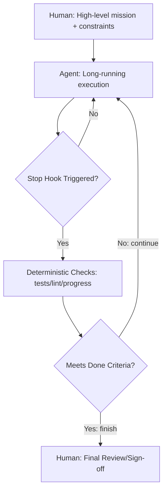

# L Thread Lab — Long-Running Autonomy

# L Thread — Long-Duration Thread

**Extended autonomy:** High autonomy end-to-end long duration work

Hours-long runs with hundreds to thousands of tool calls.[[1]](https://www.youtube.com/watch?v=-WBHNFAB0OE)

---

## Pattern Definition

### Structure



### Same Shape as Base Thread

**But:**

- Much longer duration (hours vs minutes)
- Many more tool calls (100s-1000s vs 10s)
- Higher autonomy (less likely to fail)
- Self-verification built in

---

## What Makes It Different

### Self-Verification

**Agent validates own work:**

- Runs tests automatically
- Executes validation commands
- Checks progress against goals
- Self-corrects when checks fail[[1]](https://www.youtube.com/watch?v=-WBHNFAB0OE)

**Required infrastructure:**

- Hardened permissions (can't break things)
- Guardrails (safety bounds)
- Progress signaling (heartbeat)

### Boris Cherny 1+ Day Run

**Example:** 1 day, 2 hours execution time[[1]](https://www.youtube.com/watch?v=-WBHNFAB0OE)

**Made possible by:**

- Clear mission
- Strong verification
- Ralph Wiggum plugin (stop hook)
- Trust in system

---

## Stop Hook / Validation Loop

### The "Code + Agents" Bridge[[1]](https://www.youtube.com/watch?v=-WBHNFAB0OE)

**Stop Hook workflow:**

1. Agent attempts to stop
2. Stop hook intercepts (deterministic code)
3. Run checks:
    - Progress file exists and valid?
    - Tests passing?
    - Lint clean?
    - Requirements met?
4. Decision:
    - **Continue:** Re-prompt agent with feedback
    - **Finish:** Allow agent to complete

### Boris Cherny Approach

**Option 1: Background agent verification**

When primary agent finishes, spawn verification agent[[1]](https://www.youtube.com/watch?v=-WBHNFAB0OE)

**Option 2: Agent stop hook**

Deterministic code validates before allowing completion

### Implementation Strategies

**File-based:**

```bash
# Stop hook checks progress.json
if [ -f "progress.json" ]; then
  if jq '.all_tests_passed' progress.json; then
    exit 0  # Allow stop
  fi
fi
exit 1  # Continue working
```

**Command-based:**

```bash
# Stop hook runs validation
npm test && npm run lint && npm run build
if [ $? -eq 0 ]; then
  exit 0  # Allow stop
fi
exit 1  # Continue working
```

---

## Best Practices

### Autonomy Budget

**Set limits upfront:**

- Max tool calls: 500
- Max cost: $20
- Max runtime: 4 hours
- Max context resets: 3

**Agent stops if budget exceeded**

### Progress Heartbeat

**Periodic summaries:**

Every 30 minutes, agent writes:

- Current objective
- Progress made
- Blockers encountered
- Next steps
- Estimated completion

**Enables human to:**

- Check in without interrupting
- Abort early if going wrong direction
- Learn from agent's approach

### Auto-Recovery

**Build resilience:**

- Retry policies for transient failures
- Safe rollback mechanisms
- Idempotent actions (safe to repeat)
- Checkpoints for resumption

---

## Planning for Long Runs

### Great Planning = Great Prompting

**Long threads succeed when:**

✅ Mission clearly defined

✅ Success criteria explicit

✅ Constraints well-specified

✅ Validation automated

✅ Recovery paths available

### Example L Thread Prompt

```
Mission: Refactor authentication system to use OAuth2

Scope:
- Replace custom auth with OAuth2
- Maintain all existing endpoints
- Add tests for new flow
- Update documentation

Constraints:
- Do not modify database schema
- Maintain backward compatibility
- All tests must pass
- No security vulnerabilities

Validation:
- npm test (all passing)
- npm run lint (clean)
- npm run security-audit (no high/critical)
- Manual review of /auth/* endpoints

Budget:
- Max 6 hours
- Max $25
- Stop if blocked >30 min

Progress reporting:
- Write progress.json every 30 min
- Include: status, blockers, ETA
```

---

## Relationship to Other Threads

### L Thread = Base Thread + Time + Trust

**Comes full circle:**

Same shape, just scaled up

**Progression:**

- Base: 5-10 min, 10-30 tool calls
- Extended Base: 30-60 min, 50-100 tool calls
- L Thread: hours, 100s-1000s tool calls

### Can contain other thread types

**L Thread might internally use:**

- P Thread (parallel sub-tasks)
- F Thread (try multiple approaches)
- C Thread (phased execution)

But from outside, looks like single long thread

---

## Experimentation Workspace

### Current Experiments

- **Experiment 1: 1-hour autonomous refactor**

- **Experiment 2: Stop hook implementation**

- **Experiment 3: Multi-hour feature implementation**

---

## Implementation Notes

### Your L Thread Setup

**Primary tool:**

**Stop hook mechanism:**

**Progress tracking:**

**Longest successful run:**

### Prompt Templates

**L Thread template:**

```
[Clear mission statement]

Scope: [Explicit boundaries]

Constraints: [Hard limits]

Validation: [Automated checks]

Budget:
- Time: [max hours]
- Cost: [max $]
- Tool calls: [max count]

Progress:
- Report every [interval]
- Write to [progress file]

Recovery:
- If stuck > [time], [action]
- If tests fail > [count], [action]
- If cost > [threshold], [action]

You have high autonomy. Self-verify. Self-correct.
Do not stop until validation passes.
```

---

## Success Metrics

### KPIs to Track

| Metric | Target | Current |
| --- | --- | --- |
| Max successful duration | > 2 hours | — |
| Tool calls per run | 200-500 | — |
| Success rate (first try) | > 60% | — |
| Cost per run | < $15 | — |
| Human interruptions | 0-1 | — |

### Trust Building Signals

✅ Comfortable starting L Thread before sleep

✅ Agent self-corrects reliably

✅ Progress reports match reality

✅ Validation catches real issues

✅ Ready to remove stop hook (moving to Z Thread)

---

## Next Evolution

L Thread mastery enables:

→ **Z Thread** — Remove human review, full zero-touch

→ **Multi-day runs** — Extend beyond single session

→ **Fleet management** — Multiple L Threads in parallel