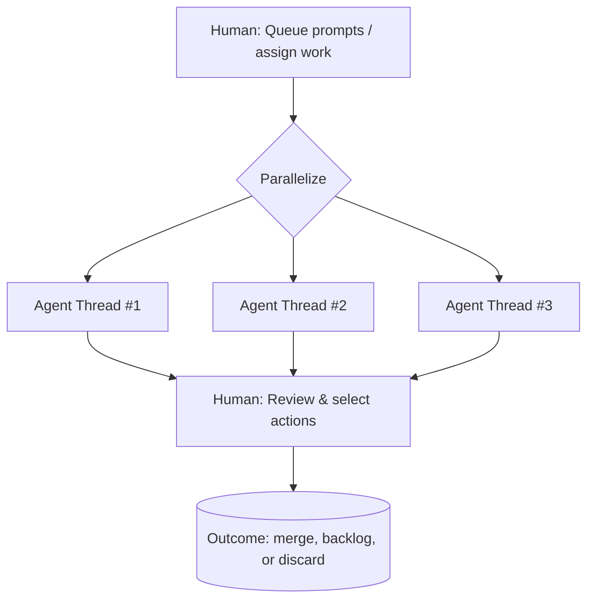

# P Thread Lab — Parallel Execution

# P Thread — Parallel Threads

**Multiple Base Threads concurrently:** Scale compute and throughput

Boris Cherny runs 5 Claude Code sessions in terminal + 5-10 in web UI.[[1]](https://www.youtube.com/watch?v=-WBHNFAB0OE)

---

## Pattern Definition

### Structure



### Two Distinct Modes

**A) Partitioned Parallelism** (different tasks)

- Each thread tackles different subproblem
- Docs, tests, refactor, feature work
- Output: set of deliverables to review

**B) Redundant Parallelism** (same prompt, multiple runs)

- Same task sent to multiple agents
- Purpose: **confidence** via convergence or diversity[[1]](https://www.youtube.com/watch?v=-WBHNFAB0OE)
- Output: choose best or merge insights

---

## When to Use

✅ Multiple independent tasks

✅ Faster iteration via more compute

✅ Multi-review / multi-opinion checking

✅ High-stakes decisions requiring validation

✅ Rapid prototyping with multiple approaches

---

## Operational Requirements

### Task Isolation

**Separate worktrees/branches to avoid collisions**

```bash
# Create worktrees for parallel work
git worktree add ../project-thread-1 -b thread-1
git worktree add ../project-thread-2 -b thread-2
git worktree add ../project-thread-3 -b thread-3
```

### Naming/Indexing

**Stable IDs for tracking thread states**

- T1, T2, T3 for simple numbering
- Feature-specific: `docs-T1`, `tests-T2`, `refactor-T3`
- Date-based: `2026-01-20-T1`

### Result Normalization

**Enforce thread output schema**

Each thread produces:

- Summary (what was attempted)
- Diff (what changed)
- Commands run (reproducibility)
- Risks identified (review focus areas)

---

## Boris Cherny Setup

### Terminal Setup (5 Claude Code instances)

**Configuration:**

- Tabs numbered 1-5
- Each tab: separate Claude Code session
- Uses Opus 4.5 (highest capability)
- Specific permissions (not dangerously-skip)

**Management:**

- System notifications for completion
- Can quickly switch between threads
- In-loop agent coding (active supervision)

### Background Setup (5-10 web instances)

**Configuration:**

- Claude Code web interface
- Use @ symbol to kick off sessions
- Can "teleport" back and forth
- Out-of-loop agent coding (check later)

**Total capacity:** 10-15 parallel threads

---

## Tools & Techniques

### Multi-Process Terminal (mprocs)

[mprocs GitHub](https://github.com/pvolok/mprocs)

Manage multiple processes in single terminal view

### Fork Terminal Skill

Create brand new terminals programmatically

### Pthread Alias

Custom command to spawn N parallel agents:

```bash
pthread <count> <agent-type> "<prompt>"
```

Example: `pthread 4 claude-code "review the Ralph Wiggum implementation"`

---

## Failure Modes

### Human Review Bottleneck

**Problem:** Too many parallel outputs, can't review all

**Fix:**

- Dashboard for thread status
- Auto-merge low-risk changes
- Prioritization system

### Context Fragmentation

**Problem:** Can't remember what each thread is doing

**Fix:**

- Thread status dashboard
- Structured logging
- Clear naming conventions

---

## Experimentation Workspace

### Current Experiments

- **Experiment 1: Partitioned parallelism**

- **Experiment 2: Redundant parallelism (best-of-N)**

- **Experiment 3: Hybrid approach**

---

## Implementation Notes

### Your Parallel Setup

**Terminal tool:**

**Max parallel threads:**

**Review strategy:**

### Prompt Templates

**Partitioned parallelism template:**

```
Thread 1: Implement feature X
Thread 2: Write tests for X
Thread 3: Update docs for X
Thread 4: Refactor related code

All threads work independently on same feature
```

**Redundant parallelism template:**

```
All threads: Design API for user authentication

Each agent proposes independent solution
Review: Compare approaches, select best elements
```

---

## Success Metrics

### KPIs to Track

| Metric | Target | Current |
| --- | --- | --- |
| Threads running concurrently | 3-10 | — |
| Throughput multiplier | 3-5x | — |
| Review time per thread | < 3 min | — |
| Successful merge rate | > 70% | — |
| Time to completion (all threads) | < 15 min | — |

### Scaling Signals

✅ Comfortable managing 5+ threads

✅ Review process has clear workflow

✅ Can predict which threads will succeed

✅ Willing to discard failed threads quickly

---

## Next Evolution

P Thread mastery enables:

→ **F Thread** — Fuse results from parallel threads

→ **B Thread** — Nest P Threads inside orchestrator

→ **Multi-terminal mastery** — Boris-level parallelism