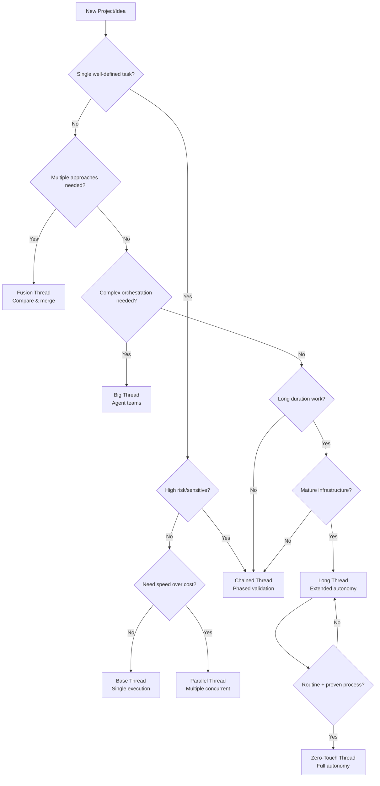

# Thread Consultant — Selection Framework

**Purpose:** Diagnostic system for recommending optimal thread patterns based on project characteristics

<aside>
⚙️

**Status:** Active development — This framework evolves as new patterns and capabilities emerge. Treat as living document with emerging components.

</aside>

---

## Diagnostic Questionnaire

Use these questions to assess project requirements and recommend thread patterns:

### 1. Scope & Complexity

**Question 1.1:** Is this a single, well-defined task, or does it involve multiple components/phases?

**Question 1.2:** Can the work be completed in one agent session, or will it require extended time?

### 2. Risk & Sensitivity

**Question 2.1:** How sensitive is this work?

- **Low:** Non-production, experimental, easily reversible
- **Medium:** Staging environment, requires review
- **High:** Production system, financial impact, compliance

**Question 2.2:** Do you need checkpoints for validation, or can the agent work autonomously?

### 3. Certainty & Exploration

**Question 3.1:** Do you know the best approach, or do you want to explore multiple solutions?

**Question 3.2:** Is this routine work you've done before, or something experimental?

### 4. Resource & Urgency

**Question 4.1:** Do you prioritize speed (more compute) or cost efficiency (single thread)?

**Question 4.2:** How much human review time do you have available?

- **High:** Can review multiple outputs
- **Medium:** One review session
- **Low:** Minimal review, need high autonomy

### 5. Infrastructure Maturity

**Question 5.1:** Do you have robust testing, monitoring, and rollback capabilities?

**Question 5.2:** Have you successfully run long-duration agent work in this codebase before?

### 6. Team & Coordination

**Question 6.1:** Does this work require coordination between multiple specialized agents?

**Question 6.2:** Do you need audit trails or compliance documentation?

---

## Decision Matrix

### Primary Recommendations

| Project Characteristic | Recommended Thread | Alternative Options |
| --- | --- | --- |
| Single, well-defined task | **Base (T0)** | C if sensitive |
| Multiple independent tasks | **Parallel (P)** | F for comparison |
| Uncertain solution approach | **Fusion (F)** | P for exploration |
| High-risk production work | **Chained (C)** | B with review agents |
| Complex workflow needs | **Big (B)** | C with manual orchestration |
| Long-duration work | **Long (L)** | C for checkpoints |
| Routine, proven processes | **Zero-Touch (Z)** | L with verification |
| Need confidence/consensus | **Fusion (F)** | P with voting |
| Resource constraints | **Base (T0)** | C for cost control |
| Learning/experimentation | **Fusion (F)** | P for variety |

### Situational Modifiers

**If high risk:** Shift toward C Thread (checkpoints)

**If time-critical:** Shift toward P Thread (parallelism)

**If exploratory:** Shift toward F Thread (multiple approaches)

**If mature infrastructure:** Consider L or Z Thread

**If learning phase:** Start with Base Thread

---

## Decision Flowchart

---

## Thread Maturity Model

### Level 0: Manual Engineering

**State:** All work done directly by humans, no agent assistance

**Baseline:** Traditional software development

**Milestone:** None (pre-agentic)

### Level 1: Single Agent Assistance

**Pattern:** Base Thread mastery

**Characteristics:**

- One agent per task
- Human review each time
- Clear prompt → execute → review pattern

**Milestone:** Consistent Base Thread execution with >80% success rate

### Level 2: Parallel Scaling

**Patterns:** P Thread + F Thread competency

**Characteristics:**

- Multiple agents working simultaneously
- Comfortable managing 3-5 threads
- Using fusion for quality improvement

**Milestone:** 5+ concurrent threads, fusion pattern usage in production

### Level 3: Orchestration Mastery

**Patterns:** B Thread + C Thread expertise

**Characteristics:**

- Agents coordinating other agents
- Phased execution for complex work
- Specialized agent teams

**Milestone:** Complex multi-agent workflows, reliable phased execution

### Level 4: High Autonomy

**Pattern:** L Thread proficiency

**Characteristics:**

- Extended unsupervised agent work (hours)
- Self-verification and progress tracking
- Stop hooks and validation loops

**Milestone:** Hours-long autonomous execution, <10% failure rate

### Level 5: Zero-Touch Operations

**Pattern:** Z Thread implementation

**Characteristics:**

- Fully autonomous objective achievement
- Review delegated to system infrastructure
- Production systems running without intervention

**Milestone:** Routine processes fully automated, silent failure rate <1%

**Progression Rule:** Be comfortable with level N-1 patterns for weeks before attempting level N

---

## Quick Reference Comparison

### Thread Overview Table

| Thread | Symbol | Duration | Autonomy | Human Touch | Use Case | Key Benefit | Primary Risk |
| --- | --- | --- | --- | --- | --- | --- | --- |
| **Base** | T0 | Minutes-Hours | Low | Start + End | Single tasks | Clarity & control | Slow throughput |
| **Parallel** | P | Minutes-Hours | Low | Start + Multi-end | Multiple tasks | Speed & confidence | Review bottleneck |
| **Chained** | C | Hours-Days | Medium | Multi-checkpoint | Risky/complex work | Risk management | Overhead |
| **Fusion** | F | Minutes-Hours | Low | Start + Fusion | Exploration | Quality & consensus | Merge complexity |
| **Big** | B | Hours | Medium | Start + End | Complex orchestration | Sophisticated workflows | Hidden complexity |
| **Long** | L | Hours-Days | High | Start + End | Extended work | Maximum autonomy | Runaway execution |
| **Zero-Touch** | Z | Ongoing | Maximum | Start only | Mature processes | Living software | Silent failures |

### Thread Relationships & Evolution

**Foundation:**

- **Base** → foundation for all others

**Scaling patterns:**

- **Parallel** → Base × N (concurrent)
- **Chained** → Base + checkpoints
- **Long** → Base + extended autonomy

**Advanced patterns:**

- **Fusion** → Parallel + combination
- **Big** → Base + orchestration

**Endgame:**

- **Zero-Touch** → Long + infrastructure trust

---

## Four Improvement Axes

Measure agentic capability growth across four dimensions:

### 1. Run MORE Threads

**Scale through parallelism and throughput**

**Metric:** Total threads executed per day/week

**Pattern progression:** Base → P → F

### 2. Run LONGER Threads

**Scale through increased autonomy**

**Metric:** Average tool calls per thread, execution duration

**Pattern progression:** Base → L → Z

### 3. Run THICKER Threads

**Scale through orchestration complexity**

**Metric:** Agents per thread, coordination complexity, nested depth

**Pattern progression:** Base → B → nested B

### 4. Run FEWER Checkpoints

**Scale through trust and verification**

**Metric:** Human interventions per unit of work, autonomous success rate

**Pattern progression:** C → L → Z

---

## Consultant Agent Workflow

### Phase 1: Assessment

1. Ask diagnostic questions (above)
2. Classify project characteristics
3. Assess infrastructure maturity
4. Determine risk tolerance

### Phase 2: Recommendation

1. **Primary thread:** Best fit for requirements
2. **Alternative 1:** If primary has constraints
3. **Alternative 2:** For different trade-offs

### Phase 3: Justification

Provide reasoning:

- Why primary recommended
- What makes alternatives viable
- Risk factors to consider
- Resource implications

### Phase 4: Template Delivery

Provide ready-to-use prompt template from relevant lab workspace

---

## Work Classification Taxonomy

*(Emerging — to be expanded)*

### Feature Development

**Default recommendation:** Base → P (if multiple components)

**Consider:** F for design exploration, B for complex features

### Migration/Refactor

**Default recommendation:** C (phased checkpoints)

**Consider:** L if well-defined, B if complex orchestration needed

### Research/Analysis

**Default recommendation:** F (multiple perspectives)

**Consider:** P for broad exploration, Base for focused analysis

### Bug Fix/Incident

**Default recommendation:** Base (focused, fast)

**Consider:** C if production-sensitive, P for multiple issues

### Automation/Pipeline

**Default recommendation:** B (orchestration)

**Consider:** L for execution, Z for mature processes

---

## Extension Points

<aside>
🔧

**Developing Areas**

This framework has extension points for future capabilities:

- **Thread Output Contract** — Standardized logging schema
- **Cost & Risk Envelope** — Automated scoring rubric
- **Hybrid Thread Patterns** — Combinations and compositions
- **Domain-Specific Recommendations** — Vertical-specific guidance
- **Team Coordination Patterns** — Multi-engineer workflows

These will be documented as they mature.

</aside>

---

## Usage Guidelines

### For Human Engineers

Use questionnaire to self-assess project needs before diving into lab workspaces

### For AI Consultant Agents

Ingest this framework as knowledge base for thread recommendations:

1. Parse project requirements
2. Apply decision matrix
3. Recommend thread pattern with justification
4. Provide template from appropriate lab

### For System Integration

This framework provides selection logic that feeds into execution workspaces (7 lab pages)

---

## Related Resources

[AI Agent Thread Patterns — Strategic Workflows](AI%20Agent%20Thread%20Patterns%20%E2%80%94%20Strategic%20Workflows%20d1c1ad7d3d0844cf8e9be3074eaad694.md) (Main hub)

**Lab workspaces for execution:**

[Base Thread Lab — T0](Base%20Thread%20Lab%20%E2%80%94%20T0%20da5a8fce50664dec81493eadbf5a82f3.md)

[P Thread Lab — Parallel Execution](P%20Thread%20Lab%20%E2%80%94%20Parallel%20Execution%20fde9f627d7464fa4978205686b295e43.md)

[C Thread Lab — Chained Checkpoints](C%20Thread%20Lab%20%E2%80%94%20Chained%20Checkpoints%20e8ee18936ae947fba6282179090a905e.md)

[F Thread Lab — Fusion Patterns](F%20Thread%20Lab%20%E2%80%94%20Fusion%20Patterns%205350f095a6714d2ebbad7f7ed10eff4a.md)

[B Thread Lab — Meta Orchestration](B%20Thread%20Lab%20%E2%80%94%20Meta%20Orchestration%20ab4145e4d17d4d19ade9791b805ad968.md)

[L Thread Lab — Long-Running Autonomy](L%20Thread%20Lab%20%E2%80%94%20Long-Running%20Autonomy%206f62574e5d3947678dcea60451b0325a.md)

[Z Thread Lab — Zero-Touch Endgame](Z%20Thread%20Lab%20%E2%80%94%20Zero-Touch%20Endgame%20096fd79cecce483c9574839608937f40.md)