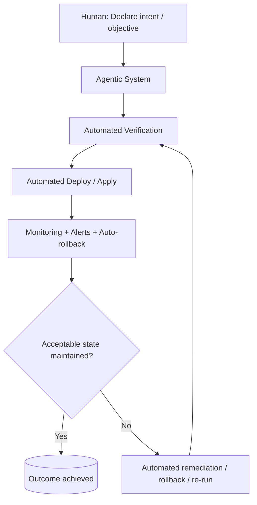

# Z Thread Lab — Zero-Touch Endgame

# Z Thread — Zero-Touch Thread

**Maximum trust:** No review node, zero-touch outcomes

"Hidden seventh thread" representing the endgame of agentic engineering.[[1]](https://www.youtube.com/watch?v=-WBHNFAB0OE)

---

## Pattern Definition

### Structure



### Key Principle

**Z Thread ≠ "no one checks anything"**

Review is **delegated** to system trust infrastructure:[[1]](https://www.youtube.com/watch?v=-WBHNFAB0OE)

- Deterministic checks (CI, tests)
- Formal policies (permissions, guardrails)
- Multiple agent review layers (internal)
- Staging/prod canaries
- Observability and monitoring

**Review replaced by system trust infrastructure**

---

## What Makes Z Thread Possible

### Trust Infrastructure Stack

**Layer 1: Automated verification**

- Comprehensive test suite
- Linting and formatting
- Security scanning
- Performance benchmarks
- Build validation

**Layer 2: Deployment safety**

- Canary deployments
- Feature flags
- Rollback automation
- Blue-green deployment
- Progressive rollout

**Layer 3: Runtime monitoring**

- Error rate tracking
- Performance metrics
- User impact monitoring
- Business metric tracking
- Anomaly detection

**Layer 4: Automated remediation**

- Auto-rollback on failure
- Self-healing systems
- Alert escalation
- Incident response automation

---

## Preconditions Checklist

### Before attempting Z Thread, must have:

✅ **Strong CI/CD**

- Tests are comprehensive
- Tests are reliable (not flaky)
- Tests run fast (< 5 min)
- CI blocks bad deploys

✅ **Reproducible Environments**

- Dev = Staging = Prod
- Infrastructure as code
- Deterministic builds
- No manual configuration

✅ **Safe Deploy Pipeline**

- Canary or progressive rollout
- Automated rollback
- Zero-downtime deployment
- Easy to revert

✅ **Bounded Agent Actions**

- Permissions model enforced
- Can't access production data unsafely
- Can't delete critical resources
- All actions auditable

✅ **Machine-Checkable Definition of Done**

- Not "looks good"
- Objective pass/fail criteria
- Automated evaluation
- No human judgment required

✅ **Monitoring + Alerting**

- Detects failure quickly (< 1 min)
- Alerts right people/systems
- Triggers automated response
- Tracks blast radius

---

## The Spectrum: In Loop → Out Loop → Zero Touch

### In Loop (Base Thread)

**Human present during execution**

- Watching agent work
- Ready to intervene
- Reviewing each decision

### Out of Loop (L Thread)

**Human absent during execution**

- Agent works autonomously
- Human reviews at end
- Trust through stop hooks and validation

### Zero Touch (Z Thread)

**Human absent from execution AND review**

- System validates itself
- Auto-deploys if validation passes
- Human notified of outcome
- Human intervenes only on failure

---

## Z Thread Maturity Levels

### Level 1: Auto-merge safe changes

**Example:** Dependency updates

```
Agent updates dependencies
  ↓
Tests pass
  ↓
Auto-merge PR
  ↓
Deploy to staging
  ↓
Monitor 1 hour
  ↓
Deploy to prod (if stable)
```

### Level 2: Auto-deploy low-risk features

**Example:** Documentation updates, UI tweaks

```
Agent implements change
  ↓
Tests + lint + security pass
  ↓
Canary deploy (5% traffic)
  ↓
Monitor error rates
  ↓
Progressive rollout if healthy
  ↓
Auto-rollback if not
```

### Level 3: Auto-execute business logic

**Example:** Weekly reports, data pipelines

```
Scheduled trigger
  ↓
Agent executes workflow
  ↓
Validation checks pass
  ↓
Results published
  ↓
Stakeholders notified
```

### Level 4: Codebase Singularity

**Endgame:** Codebase ships itself

```
Human: "We need feature X"
  ↓
Agentic system:
  - Plans feature
  - Implements
  - Tests
  - Reviews (multi-agent)
  - Deploys progressively
  - Monitors
  - Iterates on feedback
  ↓
Human: Receives notification "Feature X live"
```

---

## Is This Vibe Coding?

### NO. Z Thread ≠ Vibe Coding

**Vibe coding:**

- No verification
- "Looks good to me"
- Hope it works
- Trust without validation

**Z Thread:**

- Extensive automated verification
- Machine-checked correctness
- Know it works
- Trust through infrastructure

> "It isn't that we don't look at the code, it's that we know we don't have to."[[1]](https://www.youtube.com/watch?v=-WBHNFAB0OE)
> 

---

## Warning: Catastrophic Silent Failure

### The Risk

**If controls are weak:**

Z Thread can fail silently and catastrophically

**Examples:**

- Deploy breaks production, no alerts
- Data corruption goes unnoticed
- Security vulnerability introduced
- Business logic error ships to customers

### The Mitigation

**Never skip preconditions**

Z Thread is earned, not assumed

Build trust infrastructure first, automate review second

---

## Experimentation Workspace

### Current Experiments

- **Experiment 1: Auto-merge dependency updates**

- **Experiment 2: Auto-deploy docs changes**

- **Experiment 3: Scheduled Z Thread workflows**

---

## Implementation Notes

### Your Z Thread Readiness

**Current maturity level:**

**Preconditions met:**

**First Z Thread candidate:**

**Monitoring strategy:**

### Trust Infrastructure Checklist

**CI/CD:**

- [ ]  Comprehensive test coverage (>80%)
- [ ]  Fast test suite (<5 min)
- [ ]  Reliable tests (no flakes)
- [ ]  Automated deploy pipeline

**Safety:**

- [ ]  Canary deployment capability
- [ ]  Automated rollback
- [ ]  Feature flags
- [ ]  Progressive rollout

**Monitoring:**

- [ ]  Error rate tracking
- [ ]  Performance metrics
- [ ]  Business metrics
- [ ]  Anomaly detection
- [ ]  Alert escalation

**Remediation:**

- [ ]  Auto-rollback on failure
- [ ]  Self-healing systems
- [ ]  Runbook automation
- [ ]  Incident response

---

## Success Metrics

### KPIs to Track

| Metric | Target | Current |
| --- | --- | --- |
| Auto-merge rate | > 50% | — |
| Mean time to detection (MTTD) | < 1 min | — |
| Mean time to recovery (MTTR) | < 5 min | — |
| False positive rate | < 5% | — |
| Silent failure rate | 0% | — |

### Z Thread Confidence Signals

✅ Auto-deploys are routine, not scary

✅ Rollbacks are automatic and reliable

✅ Monitoring catches all meaningful failures

✅ Trust in system > trust in manual review

✅ Focus shifted from code review to system design

---

## The North Star

### "Living Software That Works for Us While We Sleep"

**Z Thread is the endgame:**

Your role shifts from writing code to building systems that build systems

You become irreplaceable not by coding more, but by orchestrating fleets of agents within trust infrastructure

**The future belongs to engineers who:**

- Design agent teams
- Build trust infrastructure
- Encode best practices
- Monitor system health
- Iterate on agent capabilities

**Not to engineers who:**

- Write every line of code
- Review every change manually
- Bottleneck on their time

---

## Next Evolution

Z Thread mastery enables:

→ **Codebase Singularity** — Self-shipping codebase

→ **Fleet management** — Multiple Z Thread systems

→ **Meta-engineering** — Systems that improve themselves

→ **Building the Agentic Layer** — The one meta-tactic to rule them all