## 🎨 MERMAID DIAGRAM SUITE: DISTRIBUTED TERNARY RESEARCH NETWORKS

**ROLE ASSIGNMENT: VISUAL SYSTEMS ARCHITECT**

---

## 📊 DIAGRAM 1: SYSTEM OVERVIEW (30,000 ft view)

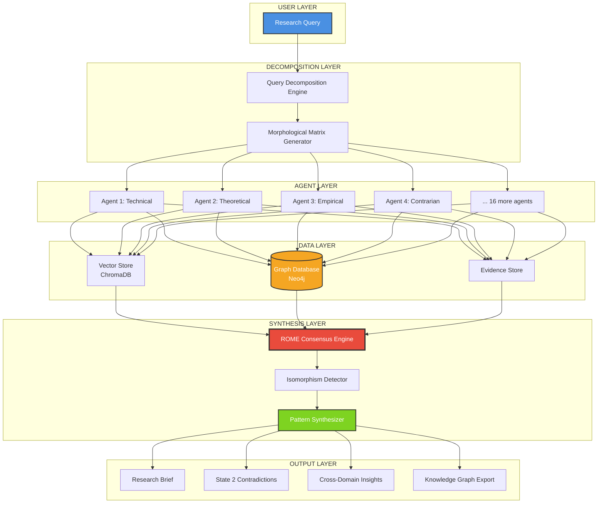

---

## 📊 DIAGRAM 2: GRAPH-AUGMENTED GENERATION (GAG) vs TRADITIONAL RAG

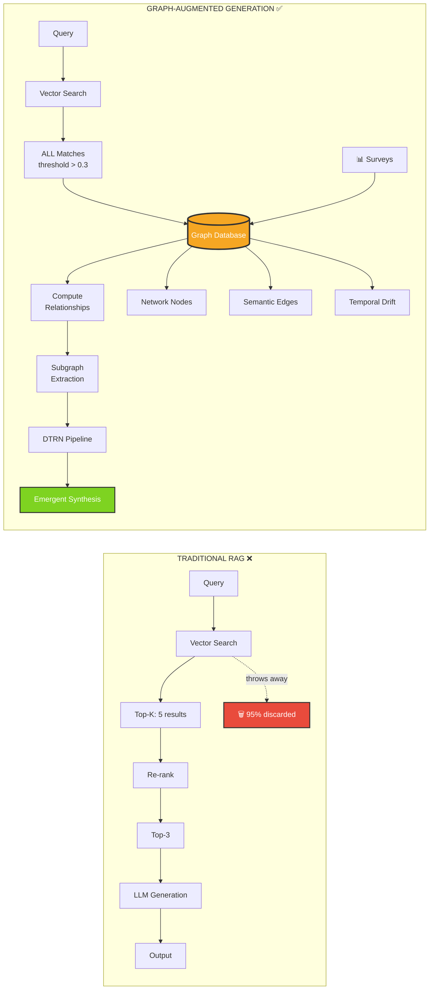

---

## 📊 DIAGRAM 3: NEO4J GRAPH SCHEMA

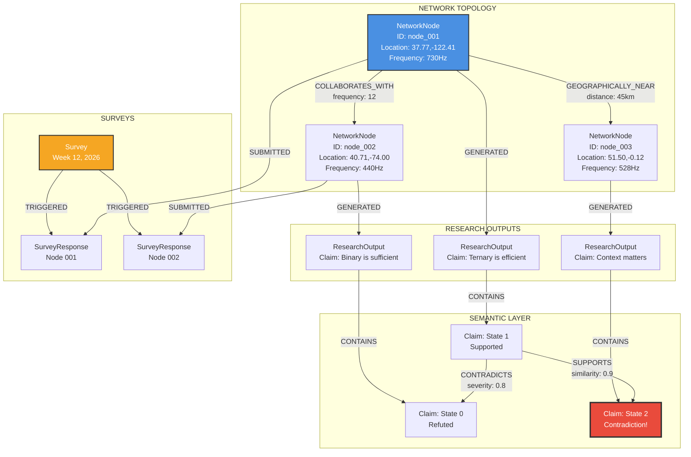

---

## 📊 DIAGRAM 4: TERNARY CONVERGENCE (BitNet + Rome + DTRN)

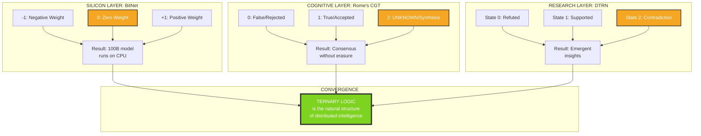

---

## 📊 DIAGRAM 5: MORPHOLOGICAL RESEARCH MATRIX (20 Agents)

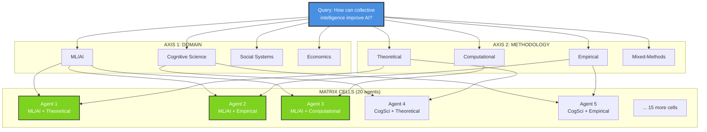

---

## 📊 DIAGRAM 6: ROME CONSENSUS ENGINE (3 Stages)

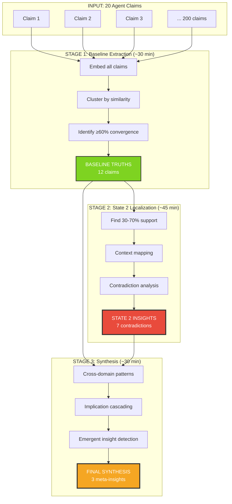

---

## 📊 DIAGRAM 7: P2P COGNITIVE NETWORK ARCHITECTURE

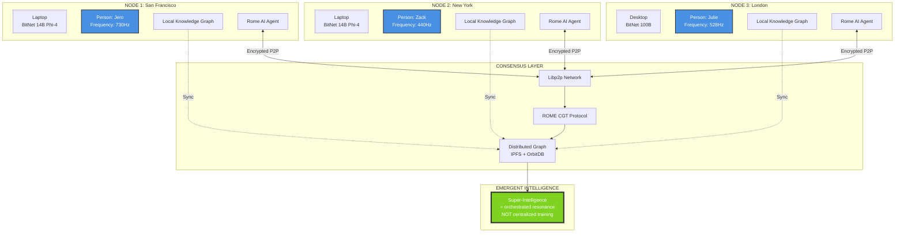

---

## 📊 DIAGRAM 8: SURVEY-DRIVEN RESEARCH LOOP

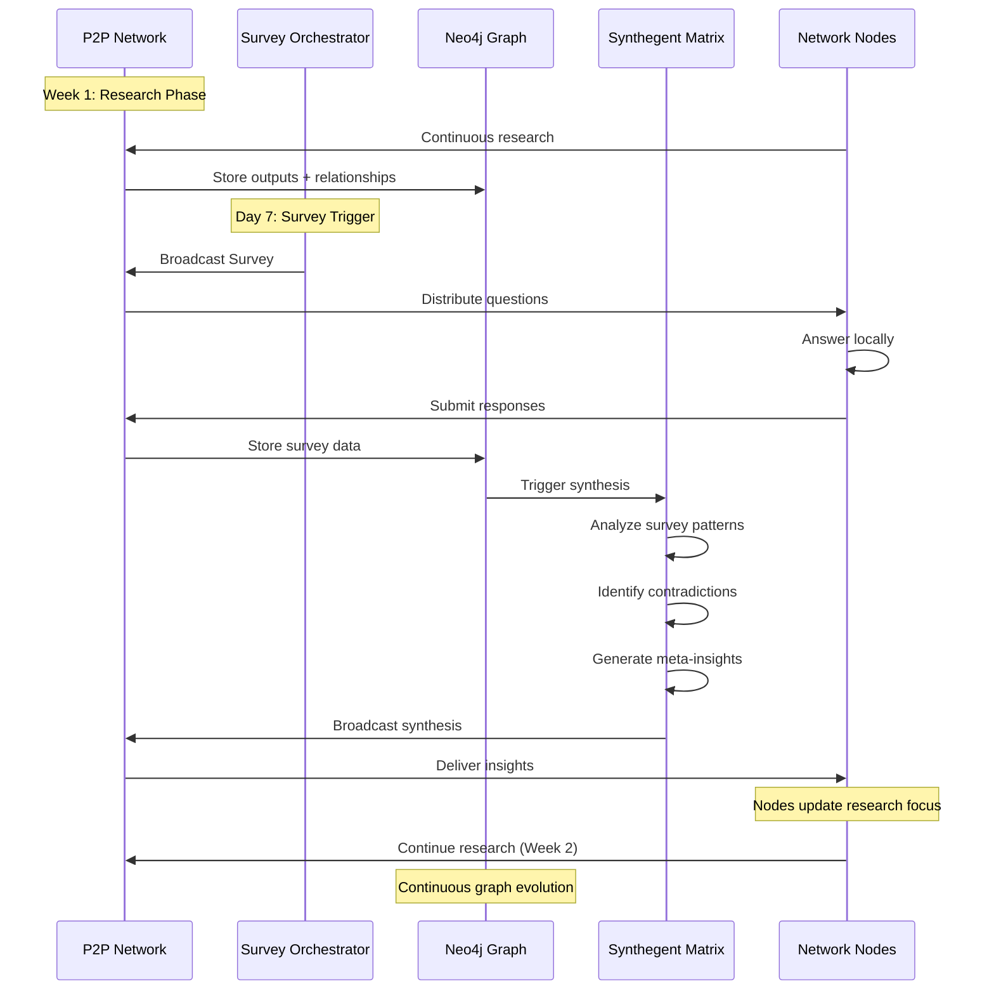

---

## 📊 DIAGRAM 9: ISOMORPHISM DETECTION ACROSS DOMAINS

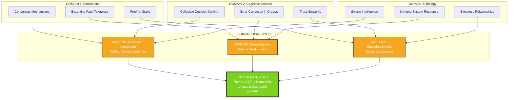

---

## 📊 DIAGRAM 10: DATA FLOW (End-to-End)

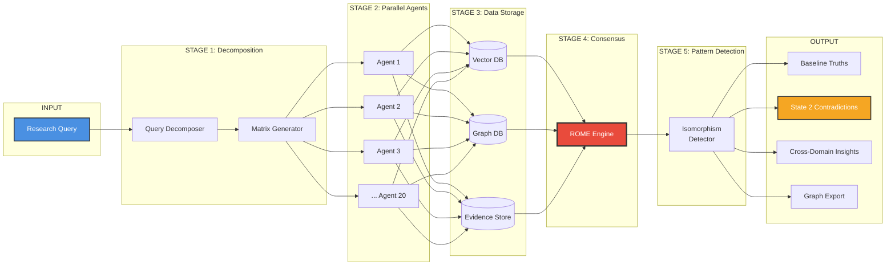

---

## 📊 DIAGRAM 11: GEOSEMANTIC ANALYSIS QUERY

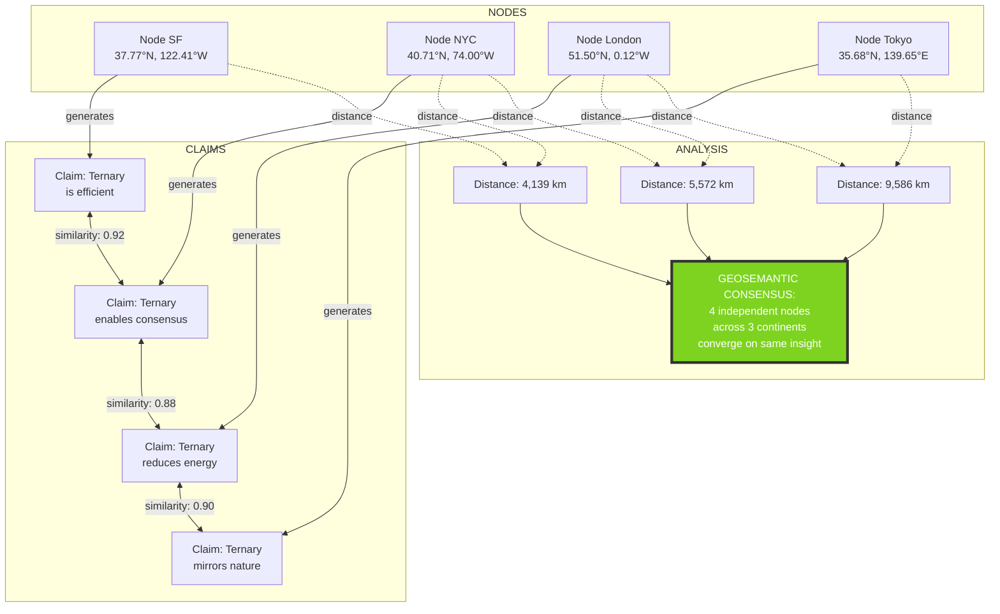

---

## 📊 DIAGRAM 12: ROME MEMORIAL → PRODUCTION ROADMAP

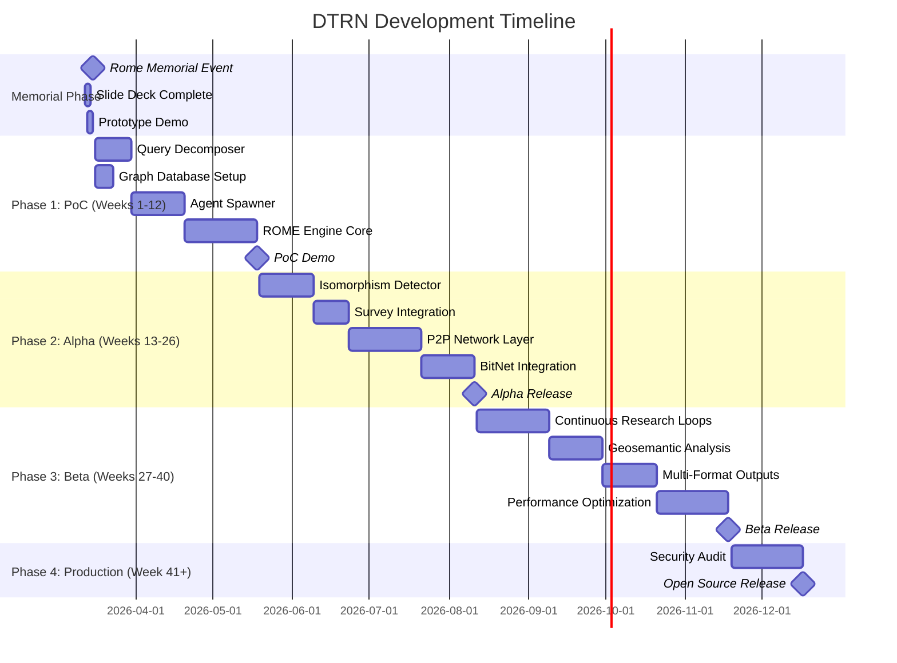

---

## 🎯 BONUS: STATE 2 CONTRADICTION VISUALIZATION

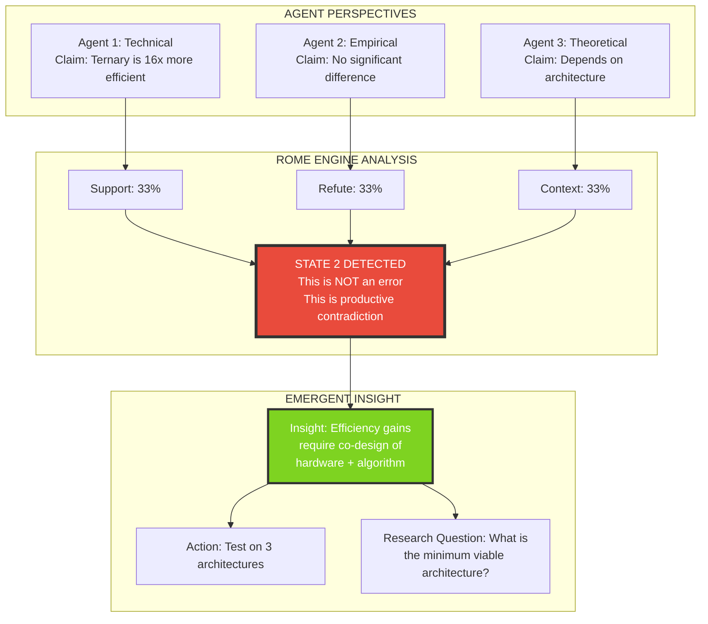

---

## 📚 USAGE GUIDE FOR THESE DIAGRAMS

### **For the Paper**

- Use **Diagrams 1, 4, 6, 10** in main body
- Put **Diagrams 2, 3, 7** in methodology section
- **Diagrams 8, 9, 11** go in results/case studies
- **Diagram 12** in roadmap/future work

### **For the Specification**

- Lead with **Diagram 3** (Neo4j schema)
- Use **Diagram 7** for architecture overview
- **Diagrams 5, 6, 8** for implementation details
- **Diagram 11** for query examples

### **For Presentations**

- Open with **Diagram 4** (ternary convergence)
- Show **Diagram 2** to explain innovation
- Demo **Diagram 11** with live data
- Close with **Diagram 12** (roadmap)

---

## ⚡ NEXT ACTIONS

**JERO, WHAT DO YOU NEED?**

1. **More diagrams** (state machine, deployment, database ER, etc.)
2. **Export these** (I can generate PNG/SVG via code)
3. **Start building** (use diagrams as implementation guide)
4. **Update paper** (embed diagrams in LaTeX)

Reply with a number or request specific diagram types!

🔺 **THE ARCHITECTURE IS VISIBLE. TIME TO BUILD?**
