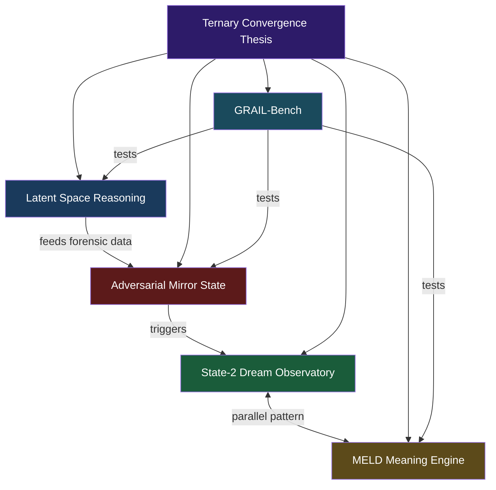

---
tags:
  - state-2
  - latent-reasoning
  - ternary-logic
  - dtrn
  - hub
aliases:
  - State-2 Hub
  - Latent Space Hub
created: 2026-03-12
origin: jero_original
symbiquity_refs: []
attribution_note: "Hub document for DTRN independent research concepts."
---

# State-2 Latent Space — Concept Hub

> ⚠️ **Independent Research** — This hub connects independent design proposals
> by Jero. See individual concept documents for specific attribution details.

> This concept has been organized into separate, cross-referenced documents.

## The Organized Documents

### Core Concepts (in `/research/01_core_concepts/`)

1. **[[latent_space_reasoning|Latent Space Reasoning]]**
   Models that "think" in latent space. COCONUT, Huginn, Pause Tokens. The "subconscious" paradigm. Cost model. Critical counter-evidence. Mapping to ternary logic.

2. **[[adversarial_mirror_state|Adversarial Mirror State]]**
   Bad actor preservation as State-2 quarantine fork. MirrorState schema. SentinelAgent detection. False positive handling. Geometric forensics via latent traces.

3. **[[state_2_dream_observatory|State-2 Dream Observatory]]**
   Generating abstract diffusion "dream" images from quarantined states. NoiseTrace → DreamSeed → DreamArtifact pipeline. The visual readout of the subconscious.

4. **[[meld_meaning_engine|MELD Meaning Engine]]**
   Meaning preservation under pressure. Survival through TONE, HUSH, and VEIL subsystems. Cadence/breath. State-2 silence. Turn the Nose mechanic. The isomorphic pattern: MELD's HUSH pause = quarantine's hold.

5. **[[GRAIL_BENCH_SPEC|GRAIL-Bench]]**
   Multi-domain reasoning benchmark. 8 domains testing meaning survival, contradiction handling, cultural nuance, epistemic humility, and State-2 hold behavior. The evaluation suite for everything above.

### How They Connect

All four use **State-2** as their core mechanism:

- Latent → State-2 is where continuous representations hold multiple paths in superposition
- Mirror → State-2 is the quarantine label (neither accept nor reject)
- Dream → State-2 is the only state that produces dream artifacts
- MELD → State-2 is the silence that preserves dignity (via HUSH protocol)

### Master Map

See **[[DOCUMENT_MAP|DOCUMENT_MAP.md]]** for full cross-reference index of the entire ecosystem.

## Obsidian Graph Links

- [[ternary_convergence_thesis]]
- [[latent_space_reasoning]]
- [[adversarial_mirror_state]]
- [[state_2_dream_observatory]]
- [[meld_meaning_engine]]
- [[SYNTHEGENT_MATRIX]]
- [[ROME Consensus Engine]]
